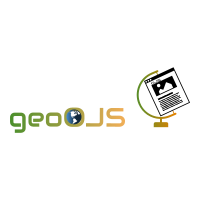
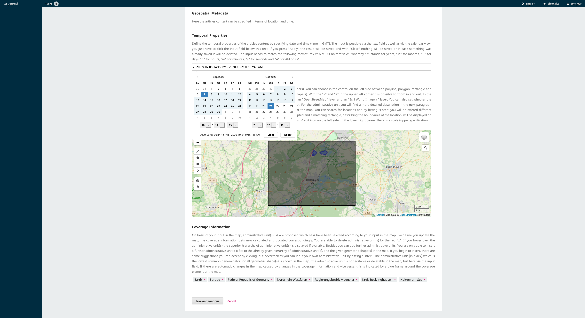
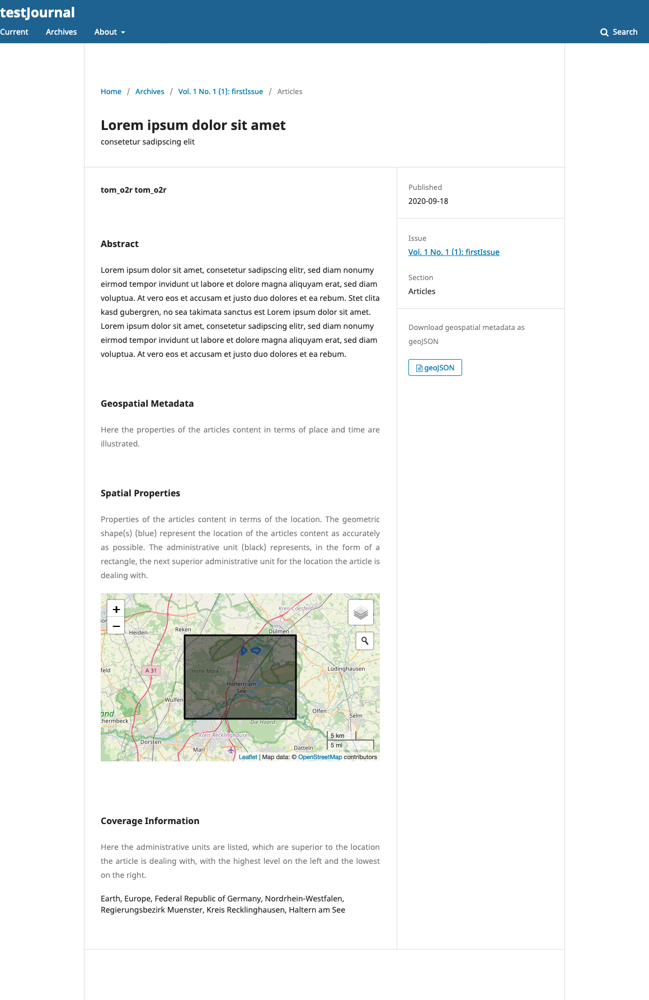
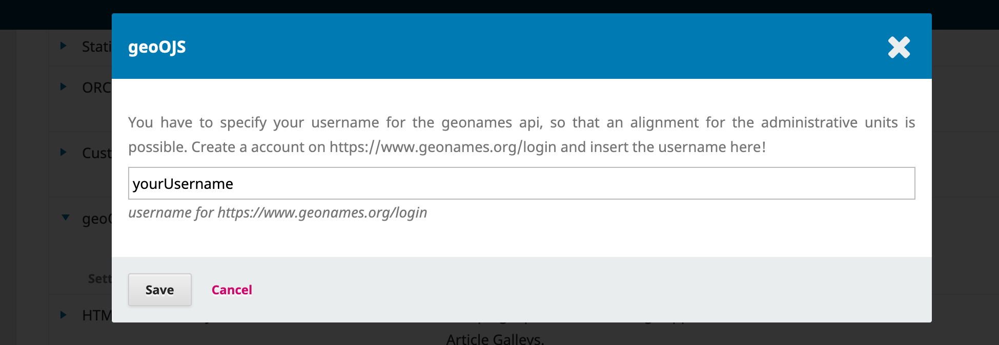

<!---created here: https://www.freelogodesign.org/preview?lang=de&name=geoOJS%20OJS&logo=421f5b45-02da-4a66-90da-d213adc643b4--->

*A plugin for integrating geospatial metadata in OJS*

**Content**
* [Abstract](https://github.com/tnier01/geoOJS#abstract)
* [Download & Installation](https://github.com/tnier01/geoOJS#download--installation)
* [Specify geonames username ](https://github.com/tnier01/geoOJS#specify-geonames-username)  
* [Contribute](https://github.com/tnier01/geoOJS#contribute)  
* [Wiki](https://github.com/tnier01/geoOJS/wiki)  

# Abstract
*geoOJS* offers a novel way for authors to provide spatial properties of research works when submitting an article to a journal based on the open source software Open Journal Systems (OJS, https://pkp.sfu.ca/ojs/)

The plugin adds the functionality, that the author can specify the articles content in terms of geospatial metadata during the submission process for submitting an article ("3. Enter Metadata"). 

<div style="text-align:center">


*Screenshot of geoOJS: geospatial properties in the OJS submission process*
</div>


Authors can either search for a location and accept the suggested bounding box or manually create one or more suitable geometric shape(s) on a map. If authors enter geometries, a gazetteer is used to suggest a matching administrative unit’s name to the author. This allows geoOJS to store geospatial data in two forms: as text, using an administrative unit or standardised geographical norm data, and as geospatial coordinates in GeoJSON format. <br>
Thereby the coordinates are stored accurately, while at the same time a textual description is accessible and flexible for non-map-related usage. In addition to displaying geospatial information on maps, it is also added to the HTML source code of article’s landing pages in a semantically meaningful way. <br> 
In the article view, the properties specified by the author are then displayed and available for download as geoJSON. 

<div style="text-align:center">


*Screenshot of geoOJS: geospatial properties in the OJS article view*
</div>

The plugin was developed as part of a bachelor thesis. This thesis can be found here: http://nbn-resolving.de/urn:nbn:de:hbz:6-69029469735. In addition, the plugin was presented at The Munin Conference on Scholarly Publishing 2020. Abstract, recording and slides can be found here: https://doi.org/10.7557/5.5590 or on youtube: https://youtu.be/-Lc9AjHq_AY.


# Download & Installation 
- to use the plugin, OJS must be running locally (further information you can find here: https://github.com/pkp/ojs)
- download the plugin here as ```geoOJS.zip```
- rename the unzipped folder ```geoOJS-master``` to ```geoOJS```
- insert the folder ```geoOJS``` in the path ```ojs/plugins/generic/``` in OJS 
- activate the plugin geoOJS in the OJS plug-in settings 
- Specify your geonames username

# Specify geonames username 
- You have to specify your username for the geonames api, so that an alignment for the administrative units is possible. 
- Create an account on https://www.geonames.org/login 
- Enter the username in the geoOJS plug-in settings (OJS -> Settings -> Website -> Plugins -> Installed Plugins -> geoOJS -> blue arrow -> Settings)!

<div style="text-align:center">


*Screenshot of geoOJS: plugin settings*
</div>


# Contribute

All help is welcome: asking questions, providing documentation, testing, or even development.

Please note that this project is released with a [Contributor Code of Conduct](CONDUCT.md).
By participating in this project you agree to abide by its terms.


# Wiki 
Further information you find in the [Wiki](https://github.com/tnier01/geoOJS/wiki). 

**Wiki Content**
* [geoJSON-Specification](https://github.com/tnier01/geoOJS/wiki/geoJSON-Specification)
* [Enable CDN](https://github.com/tnier01/geoOJS/wiki/Enable-CDN)


